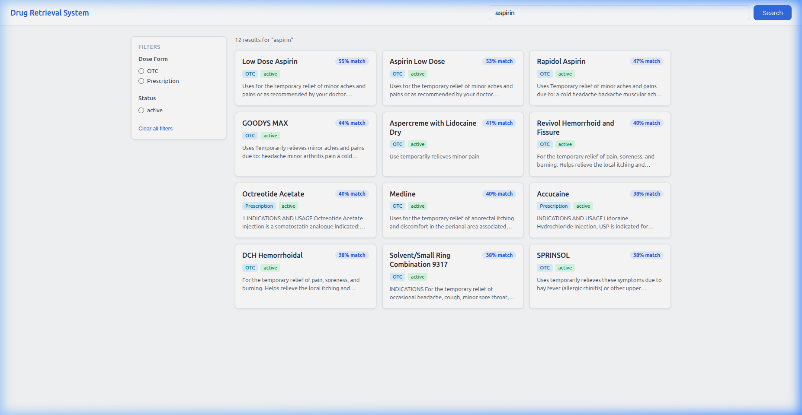
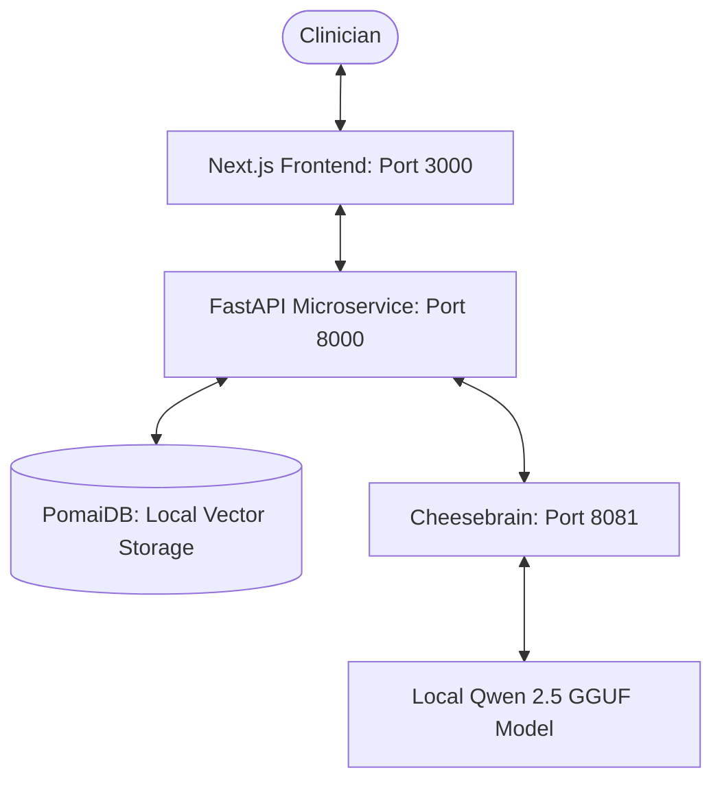

# Po-Health: Localized Clinical Decision Support System (CDSS)



Po-Health is a production-grade clinical platform designed to provide evidence-based decision support through localized AI synthesis. It bridges the gap between patient telemetry, medication safety (DDI), and institutional guidelines (RAG) using high-performance, privacy-preserving infrastructure.

## 🏗️ Architecture Overview

Po-Health operates on a localized three-tier architecture ensuring zero dependency on external AI services:



### Core Components
1. **Clinical Workspace (Frontend)**: A Next.js 14+ interface for structured SOAP notes and decision support.
2. **Clinical Microservice (Backend)**: FastAPI-based orchestration layer for RAG retrieval and safety filters.
3. **Cheesebrain (Inference Engine)**: High-performance C++ GGUF inference server for localized reasoning.

---

## 🚀 Setup & Build Instructions

### 1. Build the Inference Engine (`cheesebrain`)
Po-Health uses a custom fork of a high-performance C++ runtime.

```bash
cd cheesebrain
cmake -B build -DGGML_AVX2=ON # Enable AVX2 for x86 CPUs
cmake --build build --config Release -j$(nproc)
```
The binary will be located at `cheesebrain/build/bin/cheese-server`.

### 2. Clinical Model Acquisition
We recommend the **Qwen 2.5** series for its clinical reasoning proficiency and localized performance.

| Model Variant | Recommendation | Size |
| :--- | :--- | :--- |
| **Qwen 2.5 0.5B** | Real-time clinical impressions / Low-spec HW | ~650 MB |
| **Qwen 2.5 1.5B** | Balanced reasoning and throughput | ~1.6 GB |
| **Qwen 2.5 7B** | High-fidelity specialty clinical analysis | ~5.5 GB |

**Quick Download (0.5B Q8_0):**
```bash
mkdir -p models
curl -L -o models/clinical_reasoner.gguf https://huggingface.co/Qwen/Qwen2.5-0.5B-Instruct-GGUF/resolve/main/qwen2.5-0.5b-instruct-q8_0.gguf?download=true
```

### 3. Backend Microservice Setup
Requires Python 3.12+.

```bash
python -m venv .venv
source .venv/bin/activate
pip install -r services/requirements.txt
```

### 4. Frontend Workspace Setup
Requires Node.js 20+.

```bash
npm install
```

---

## 🚦 Running the Platform

To launch the full Po-Health stack, start the following services in order:

### 1. Inference Server
```bash
./cheesebrain/build/bin/cheese-server -m models/clinical_reasoner.gguf --port 8081
```

### 2. Clinical Microservice
```bash
python services/server.py
```

### 3. Clinical Frontend
```bash
npm run dev
```

The platform is now accessible at **http://localhost:3000**.

---

## 🧠 Clinical Reasoning Agent

The agent synthesizes cross-domain data into actionable insights:
- **Telemetry Analysis**: Real-time heartbeat/BP trend monitoring.
- **DDI Filter**: Graph-based safety checks for polypharmacy risks.
- **RAG Guidelines**: Semantic retrieval from institutional clinical protocols.
- **SOAP Automation**: One-click incorporation of AI-suggested plans into patient notes.

---

## 🛡️ Data Sovereignty & Security
- **Strictly Local**: No patient data ever leaves your hardware.
- **Isolated Membranes**: PomaiDB ensures data isolation between patient EHR and institutional research data.
- **Audit Logging**: All clinical reasoning results include timestamps and RAG evidence source attribution.
